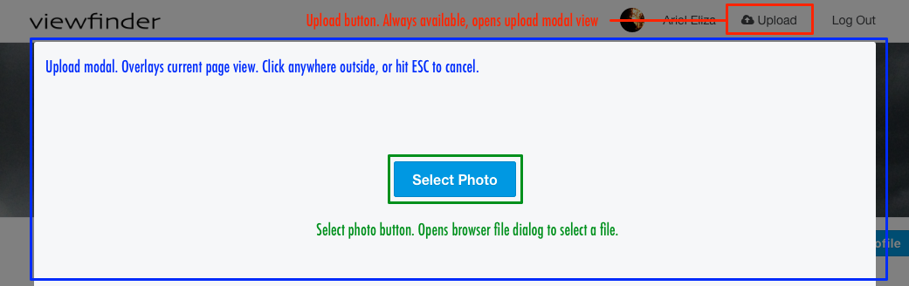
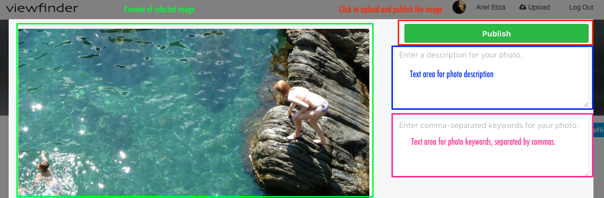
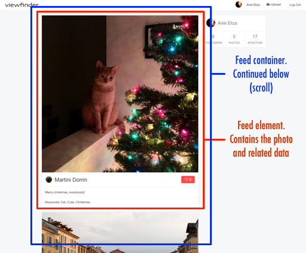
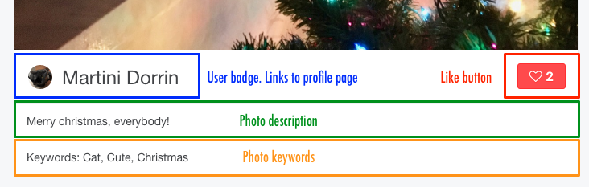
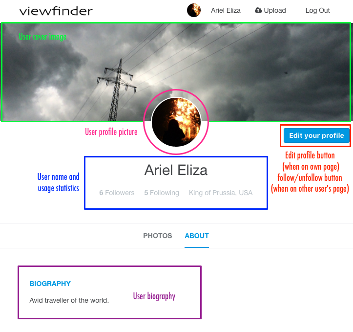
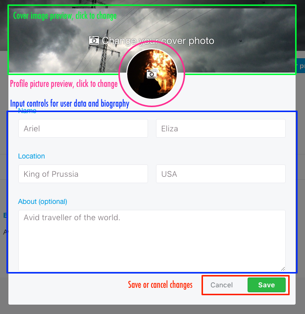
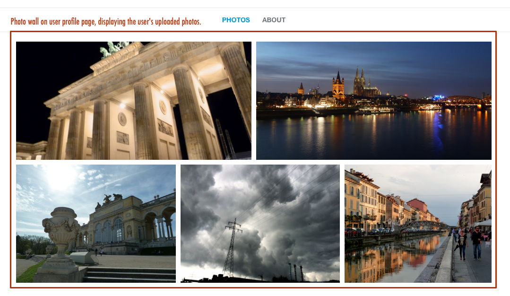

[www.viewfinder.tech](http://www.viewfinder.tech)

Viewfinder is a full-stack web application inspired by [500px](http://www.500px.com). The backend is build with [Ruby on Rails](http://rubyonrails.org), and a [PostgreSQL](https://www.postgresql.org) database. The frontend utilizes [React.js](https://facebook.github.io/react/) with a [Redux](http://redux.js.org) framework.

Viewfinder was created by [Maurice Spiewack](https://www.linkedin.com/in/mspiew) while attending [App Academy](https://www.appacademy.io) in New York City.

## Features & Implementation

### Photo upload and storage

Photo upload is handled through the [Paperclip](https://github.com/thoughtbot/paperclip) addon for Rails. The photos themselves are stored in [AWS S3](https://aws.amazon.com/s3/), and served directly from there as requested.

Users can upload photos from anywhere on the page through the always visible "Upload" button. This will open a [react-modal](https://github.com/reactjs/react-modal) window, asking the user to select a picture file from their computer:



After the user has selected a picture file from their hard drive, they can add additional data before uploading it:



When the user selects to publish a picture, it is uploaded to AWS and being made available for display in the photo feed.

### Photo feed

Every user receives a custom user feed containing pictures posted by the User, and by other Users followed by the User:



More photos can be accessed by scrolling down. The user can interact with the pictures by liking them, or by viewing the posting user's profile page:



The photo feed implements infinite scroll. Initially, only three images are loaded; once the bottom of the page is hit, more pictures are loaded on demand.

### User Profile

Every user has a profile page, which can be viewed by any other user. It shows the user's pictures, a biography and other user data:



When editing their own profile page, users can enter biographical data and choose the profile and cover pictures:



### User Gallery view

On any user's profile page, Photos are displayed in a "Brick wall" layout:



This is done by utilizing a CSS [flexbox](https://www.w3.org/TR/css-flexbox-1/) which automatically allocates available space according to the images sizes. To prevent images from being stretched, object-fit is used, which crops the picture as needed. This is accomplished with the following CSS definitions:

```css
.container {
  display: flex;
  flex-wrap: wrap;
  align-content: flex-start;
  justify-content: space-between;
}

.photo {
  margin: 5px;
  max-height: 250px;
  object-fit: cover;
  flex-grow: 2;
  flex-shrink: 2;
}
```

## Future Directions for the Project

To further enhance the project, the following features are planned:

### Search

Search photos by Keywords and description. Search Users by name, biography, and location. Allow for search filters, p.e. "Most popular".

### Comments

Allow users to comment on photos.

### Notifications

Notify users about changes, p.e. when another user starts following them, when a photo is liked, and so forth.

### Galleries

Galleries are collections of images created by users. Users can select both from their own, and from other user's pictures. Galleries can be enhanced with additional comments and keywords chosen by the gallery creator.

### Guided user creation

When signing up as a new user, display initial categories based on keywords; ask new user to mark preferences (p.e. 'Architecture', 'Nature' and so forth). Once the account is created, automatically follow users who post pictures that fit in those categories. This will allow the new user to receive an initial feed.
